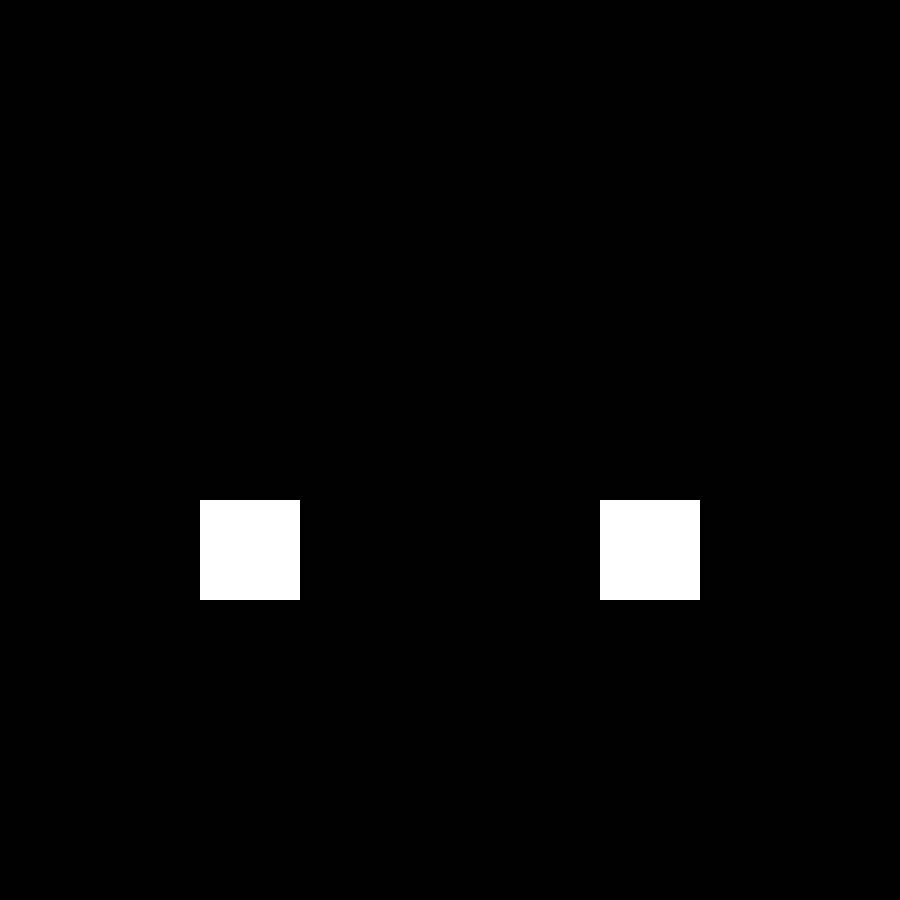
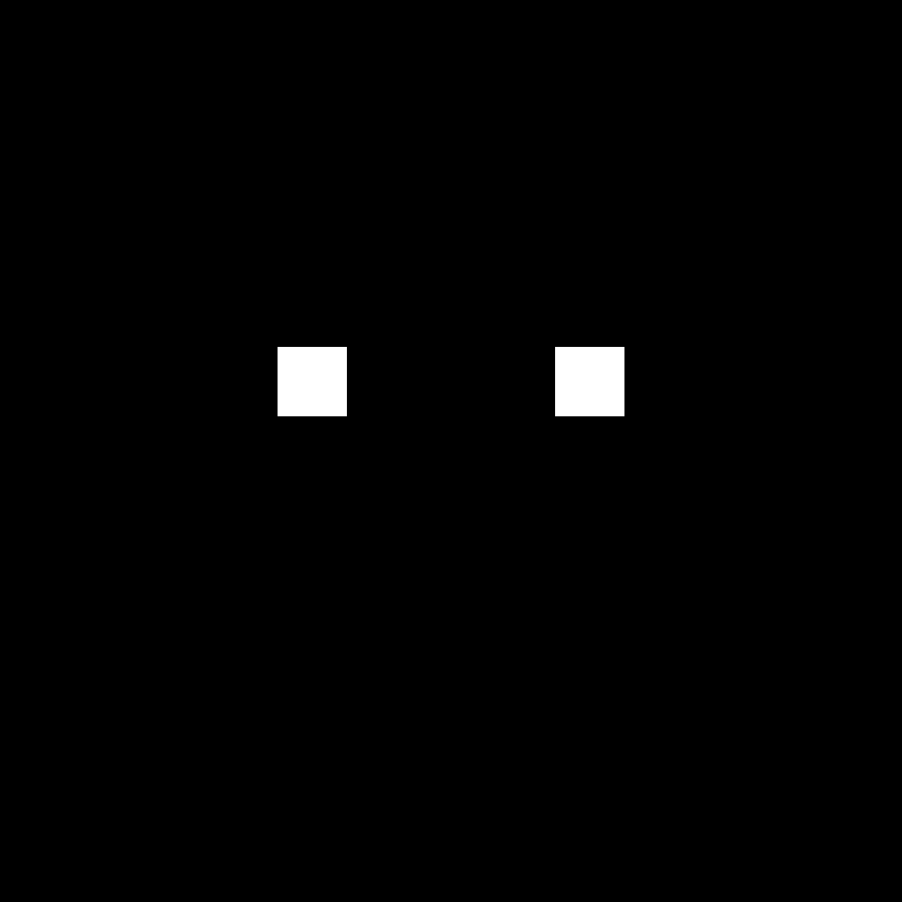
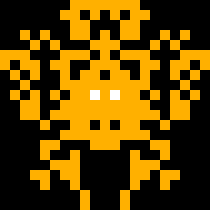
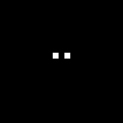

# Space invaders gen

This project procedurally generates retro-style “Space Invader” sprites by combining randomness, symmetry, and simple image rendering. It my entry to participate in the code challenge of Creative Coding Amsterdam, 2025.

# High level explanation

1. Matrix Grid Setup
Each invader is built on a square grid (e.g. 13x13). This grid stores 0 (empty) or 1 (filled) values that represent pixels of the invader.

2. Eye Placement
Eyes are placed randomly within the middle third of the grid to keep them visually balanced. Once one eye is placed, the second is mirrored to the opposite side for symmetry.

3. Body Construction
Starting from the eyes, random filling is applied outward to create a body.
A probability-based algorithm ensures more pixels are likely to be filled closer to the eyes, tapering off with distance.
The grid is mirrored horizontally so both sides of the invader are symmetric. Extra filling ensures the area between the eyes doesn’t look hollow.

4. Coloring
Two colors are used: Body Color: applied to all filled pixels (1s in the grid). Eye Color: applied specifically to the eye positions.

5. Rendering
The pixel grid is scaled up (e.g. 10x) and converted into an image using Pillow (PIL)


# Examples


## Small 9x9 - Scale 100




## Medium 13x13 - Scale 100




## Large 21x21 - Scale 10




# Installation

1. **Clone the repository**

```bash
git clone git@github.com:nmoya/space-invaders-generator.git
cd space-invaders-generator
```

2. **Install dependencies using uv**

```bash
uv init
uv install
```

# **Space invaders generator**

## Parameters

The script accepts the following command-line arguments:

| Argument       | Type | Default                | Description                         |
| -------------- | ---- | ---------------------- | ----------------------------------- |
| `--count`      | int  | 50                     | Number of invaders to generate      |
| `--size_xy`    | int  | 13                     | Width and height of the invader     |
| `--scale`      | int  | 10                     | Scale factor for the invader images |
| `--body_color` | str  | "(255, 176, 0)"        | Color of the invader body           |
| `--eye_color`  | str  | "(225, 225, 225)"      | Color of the invader eyes           |
| `--folder`     | str  | "./invaders_medium_13" | Output folder for invaders          |


```bash
uv run invaders_gen.py --count 50 --size_xy 13 --scale 10 --body_color "(255, 176, 0)" --eye_color "(255, 255, 255)" --folder invaders_medium_13
```


# Gif extractor

## Parameters

The script accepts the following command-line arguments:

| Argument       | Type | Default    | Description                        |
| -------------- | ---- | ---------- | ---------------------------------- |
| `gif_path`     | str  | *required* | Path to the GIF file               |
| `--output_dir` | str  | frames     | Directory to save extracted frames |

```bash
uv run gif_extractor.py invaders_medium_13\invader_0.gif --output_dir gif/
```

